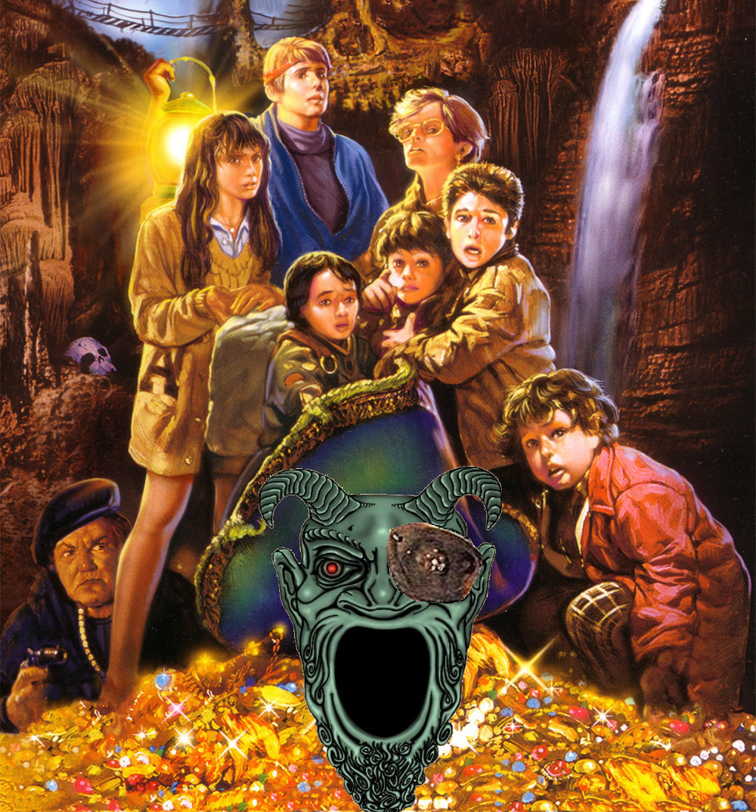

# One-Eyed Willy's Prison of Pop Culture Peril

The past few years have not been kind to the Walsh family and their friends. Mikey and Brand were on a high after recovering the jewels from One-Eyed Willy's grotto. However, Mr. Walsh's assertion that the jewels were valuable beyond compare turned out to be very, very wrong. Made of materials unknown to earth, no jeweler would purchase them. Because of that, the Walsh's could only watch helplessly as their house was bulldozed by the Perkins clan to make room for Troy's Herbalife outreach center. The Walsh family moved from scenic Astoria to the rather less nice city of San Dimas, where Mikey and Brand got mixed up in cult activity.

While the jewels were not worth much by earthly standards, they possessed weird cosmic power. The seven people who handled the crystals extensively began to experience changes. Their bodies transformed from manifestations of eldritch energy. They gained strange and forbidden knowledge. Twisted dreams haunted both sleep as well as waking hours. The descent into the surreal was rapid and ceaseless. Most disturbing, The Goonies discovered that the movies and music they consumed became bizarrely manifest in the real world - and it was difficult to tell fact from fantasy. After some ewoks burned Andy's father alive, the group decided something must be done.

Through communication with forces beyond the ken of mortal man, Mikey and Brand discovered that none other than One-Eyed Willy was behind these changes. And to escape his grasp, they would need to confront him in his island lair, find his phylactery, and destroy it.

After sacrificing their younger brother to the Goblin King, Mikey and Brand found Willy's lair. It was far out in the Pacific, concealed by space-time distortions. Assembling their now transformed gang of friends, along with a number of wayward youths from the greater Los Angeles area, they secured passage to the island on a migrating Byakhee flock for one final deathcrawl to defeat Willy or die trying.

From high above, the macabre skeletal grin of large black granite rocks in an open field confirmed they had the right island. They landed in the field, west of a white house, with a boarded front door. Nearby stood a mailbox.

## Directory Structure

Currently, the entire adventure is formatted via markdown [here](prison-of-pop-culture-peril.md).

**Maps:** Scans of the maps.
