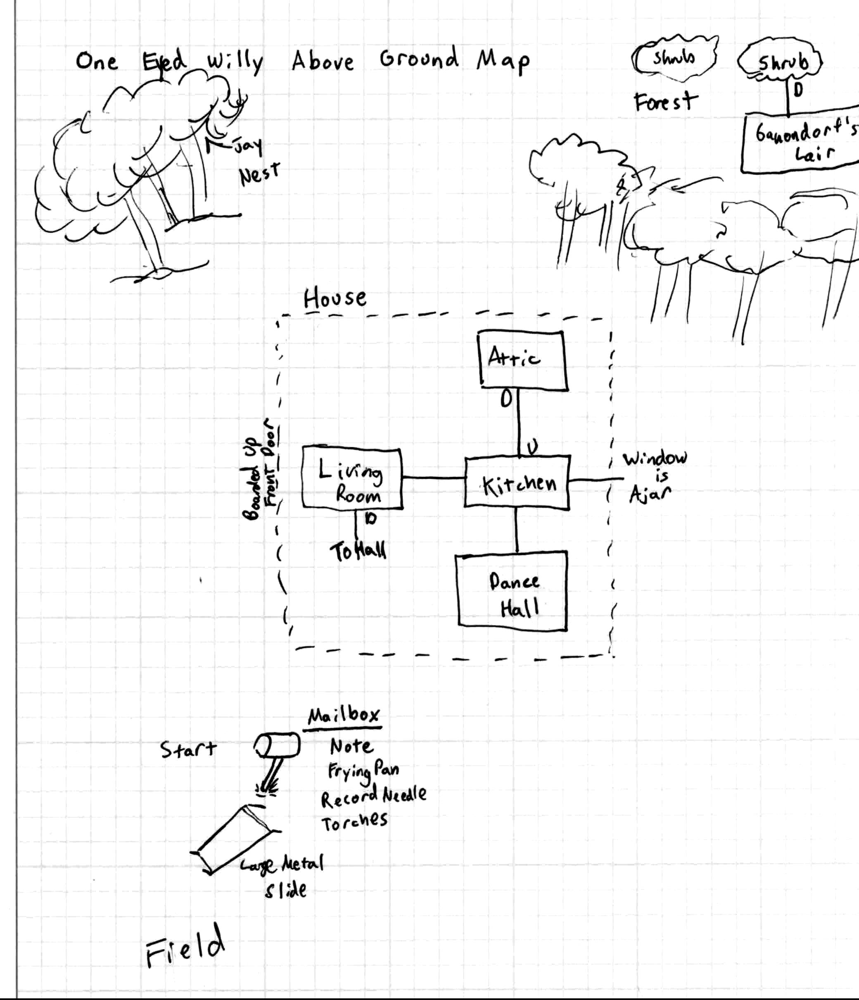

# One-Eyed Willy's Prison of Pop Culture Peril

The past few years have not been kind to the Walsh family and their friends. Mikey and Brand were on a high after recovering the jewels from One-Eyed Willy's grotto. However, Mr. Walsh's assertion that the jewels were valuable beyond compare turned out to be very, very wrong. Made of materials unknown to earth, no jeweler would purchase them. Because of that, the Walsh's could only watch helplessly as their house was bulldozed by the Perkins clan to make room for Troy's Herbalife outreach center. The Walsh family moved from scenic Astoria to the rather less nice city of San Dimas, where Mikey and Brand got mixed up in cult activity.

While the jewels were not worth much by earthly standards, they possessed weird cosmic power. The seven people who handled the crystals extensively began to experience changes. Their bodies transformed from manifestations of eldritch energy. They gained strange and forbidden knowledge. Twisted dreams haunted both sleep as well as waking hours. The descent into the surreal was rapid and ceaseless. Most disturbing, The Goonies discovered that the movies and music they consumed became bizarrely manifest in the real world - and it was difficult to tell fact from fantasy. After some ewoks burned Andy's father alive, the group decided something must be done.

Through communication with forces beyond the ken of mortal man, Mikey and Brand discovered that none other than One-Eyed Willy was behind these changes. And to escape his grasp, they would need to confront him in his island lair, find his phylactery, and destroy it.

After sacrificing their younger brother to the Goblin King, Mikey and Brand found Willy's lair. It was far out in the Pacific, concealed by space-time distortions. Assembling their now transformed gang of friends, along with a number of wayward youths from the greater Los Angeles area, they secured passage to the island on a migrating Byakhee flock for one final deathcrawl to defeat Willy or die trying.

From high above, the macabre skeletal grin of large black granite rocks in an open field confirmed they had the right island. They landed in the field, west of a white house, with a boarded front door. Nearby stood a mailbox.

# Characters

It doesn't matter too much who takes what sort of character. Although, having at least one spellcaster is fun!

* Andrea "Andy" Carmichael - Level 5 Warrior
* Richard "Data" Wang - Level 5 Thief
* Brandon "Brand" Walsh - Level 5 Dwarf
* Clark "Mouth" Deveraux - Level 5 Cleric (Patron: Gozer the Gozerian)
    * Recommended Spells: (First) Darkness, Detect Evil, Food of the Gods, Holy Sanctuary, Second Sight, Word of Command, (Second) Banish, Binding, Curse, Divine Symbol, Stinging Stone, (Third) Animate Dead, Bolt from the Blue
* Lawrence "Chunk" Cohen - Level 5 Halfling
* Stephanie "Stef" Steinbrenner - Level 5 Wizard (Patron: Jareth the Goblin King)
    * Recommended Spells: (First) Chill Touch, Enlarge, Find Familiar, Invoke Patron, Feather Fall, (Second) Locate Object, Scorching Ray, (Third) Lightning Bolt
* Michael "Mikey" Walsh - Level 5 Elf

And many zero level teenagers serving as fodder! I tend to give out four for each player, along with their one main character. I recommend using Teens out of Time from **Purple Sorcerer**. https://purplesorcerer.com/create_party.php

## Find Familiar

When running this, I've allowed Find Familiar to work in a much shorter time interval than normal. Roll for the type of familiar:

1. Face Hugger
2. Mogwai
3. 'Bit' (From Tron)
4. Ewok

## Minion Rule

In order to keep the "main" characters alive for as long as possible, I allow players to assign damage to zero level minions instead of their characters. Normally, this results in the death of the minion. But that's what they're for!

## Gozer the Gozerian

Gozer is a patron for Mouth.

## Jareth the Goblin King

Jareth is Stef's patron. I use Sezrekan as the basis for this patron. However, if invoke patron is successful, I also let Stef beseech Jareth for help finding an item instead of aid with spells.

Basically, any successful result can be used to gain a clue.

# Wandering Monsters

Roll for wandering monsters and light sources every turn or so. Where "turn" is defined as the time it takes for one lengthier action, like exploring a room.

1. 1d4 Face Huggers
2. 1d6 Cobra Kai Karate Skeletons
3. 1d6 Gremlins
4. Zuul
5. Vinz Clortho
6. The Thing

## Light

For light sources, use the Usage Die from Black Hack. Torches have a usage die of d4. On a one or two it goes out. The lantern has a usage die of d12. On a one or two, it goes to a d10. Then a d8, etc. But huddling around one light source is tricky!

The main reason for light sources to go out is to heighten the tension of grue attacks. Each turn they're in the dark, and very shortly after the last light source dies, they must save vs. reflex or take d12 damage. Grues attack in the dark.

# Monster Stats

## Zuul (Gatekeeper) / Vinz Clortho (Keymaster)

These monsters could also be summoned by the Invoke Patron. If these two beasts find each other and mate, they open the gateway to another world. This can be used to teleport off of the island.

* Init: +3
* Bite: +8 (1d12)
* AC: 18
* HD: 4d6
* HP: 23
* Spd: 25, Leap: 50
* Fort: +3
* Ref: +5
* Will: +2

## Ganondorf

Ganondorf teleports arround annoyingly. It is difficult to get more than one hit on him before he teleports to another character.

* Init: +4
* Sword Strike: +4 (1d12)
* AC: 13
* HD: 4d6
* HP: 33
* Spd: 10
* Fort: +3
* Ref: -3
* Will: +1

## Abe Froman the Sausage Golem

Mostly sits upon his thrown, throwing sausages out at the characters.

* Init: -2
* Sausage Strike: +8 (2d6)
* AC: 12
* HD: 5d6
* HP: 43
* Spd: 10
* Fort: +3
* Ref: -3
* Will: +1

## Cobra Kai Commandos

These "skeletons" say things like "sweep the leg" and "get him a bodybag" when they attack. They may be turned as normal skeletons.

* Init: +0
* Kick: +2 (1d4)
* Sweep the Leg: DC 15 Ref or toppled prone
* AC: 13
* HD: 2d6
* HP: 7
* Spd: 30
* Fort: +0
* Ref: +5
* Will: +0

## Gremlin

Prior to shifting form, these are fairly nice beings. They can actually be used to help figure out what's ahead, since they are somewhat intelligent. If they get wet or fed after midnight, though, they turn into terrible gremlins.

* Init: +6
* Baseball Bat: +4 (2d4)
* AC: 19
* HD: 2d6
* HP: 8
* Spd: 30
* Fort: +3
* Ref: +5
* Will: +2

## Face Hugger

Will storm towards the nearest teen's face and try to hug them.

* Init: +3
* Face Hug: +5 (lay eggs)
* Lay Eggs: DC 25 Fort save or infected by alien
* AC: 19
* HD: 4d6
* HP: 9
* Spd: 30
* Fort: +3
* Ref: +5
* Will: +2

## Alien

If a face hugger implants in a victim, an alien will burst forth on a 1 on a d4. Roll every time torches are rolled for.

* Init: +3
* Tail Whip: +4 (1d4 + acid)
* Acid: DC 15 Fort save or 1d4 dmg / round until successful Fort save or healed
* Bite: +7 (1d8)
* AC: 18
* HD: 4d6
* HP: 17
* Spd: 25, Leap: 50
* Fort: +3
* Ref: +5
* Will: +2

## Abe Froman the Sausage Golem

Mostly sits upon his thrown, throwing sausages out at the characters.

* Init: -2
* Sausage Strike: +8 (2d6)
* AC: 12
* HD: 5d6
* HP: 43
* Spd: 10
* Fort: +3
* Ref: -3
* Will: +1

## Slimer the Ghost

Slimer also has ectoplasm vomit.

* Init: +2
* Draining Touch: +4 (1d4 Strength / Agility / Stamina)
* Horrifying: Will DC 15 or attack -4, want to run away 
* AC: 12
* HD: 2d12
* HP: 15
* Spd: 25
* Fort: +2
* Ref: +4
* Will: +6

## The Thing

The thing will eat one random 0-level character. Any time another character is alone with the Thing, it will attack.

* Init: +2
* Shapeshift: The Thing takes on the form of any character it kills.
* AC: 10
* HD: 4d6
* HP: 22
* Spd: As Character
* Fort: +4
* Ref: +2
* Will: +0

## Fratelli Zombies

These are fairly standard zombies from DCC.

* Init: -1
* Bite: +4 (1d6)
* AC: 13
* HD: 3d6
* HP: 14
* Spd: 15
* Fort: +4
* Ref: -4
* Will: +2

## One-Eyed Willy The Lich

One-Eyed Willy is modeled off of Acererak from Tomb of Horrors. It is hard to hit unless the weapons used are coated in ectoplasm or the characters are ghost like. It's a flying green pirate lich skull.

Ectoplasm coated weapons grant a +6 to hit Willy. Ghost like characters, those that have gone through Willy's demon mouth in the main hall, get the same bonus (the bonuses do not stack).

* Init: +2
* Draining Touch: +8 (3d6 damage to either Strength / Agility / Stamina)
* Horrifying: Will DC 15 or attack -4, feel tremendous dread
* Eye Blast: +0 or sucked into eye, fort save to avoid 
* AC: 20
* HD: 3d12
* HP: 22
* Spd: 25
* Fort: +2
* Ref: +4
* Will: +6

Each round, Willy can do Draining Touch and Eye Blast. If Eye Blast is successful, not only is the target gone for good, but Willy heals d6 hp of damage. Let the player choose which attributes draining touch affects. They can divide up the damage.

# Locations



## Open Field

The byakhees drop the characters off in a field. There is a mailbox here. A bluejay is on the mailbox, eyeing the characters suspiciously. Eventually, the bird flies away toward the forest behind the house. The bluejay is a clue that something is in the trees.

There are some dense woods on the other side of the house.

Inside the mailbox is a **note**, a **frying pan**, a **record player needle**, and **torches** equal to half the number in the party. Nearby the mailbox is a **very large metal ramp**. It would take four characters to carry the ramp.

The note reads as follows.

```
WELCOME TO ONE-EYED WILLY’S PRISON OF POP CULTURE PERIL!

GOZER AND I GROW WEARY OF ONE-EYED WILLY’S BRAGGING.
WE ARE ABLE TO PROVIDE SOME SMALL AID IN HIS DEFEAT.
HIS DEFENSES ARE FOUND TO BE LAGGING.

LOOK HIGH AND LOW FOR TREASURES OF SUNNY SIDED BLUE
THEY'RE HERE, SHE SAID, ABOUND CLUES

STAY ON THE PURPLE UNTIL IT TURNS ORANGE
BURN YOUR SHRUBS AND RIDE THE LIGHTNING

BE AFRAID OF THE DARK BECAUSE GRUES
AREN'T WORTH FIGHTING

STAY RIGHT ROUND ANY BEND
A BOLD STEP PORTENDS
SPELL THE SPEAKING ENCHANTMENT 
FIND ALL OF THE ENHANCEMENTS

WITH SOME WIT, SOME LUCK, AND MAYBE AN ALLY OR TWO
YOU CAN LIFT ONE-EYED WILLY’S CURSE AND RETURN WITH YOUR CREW

YOURS,

JARETH THE GOBLIN KING

```

## Forest

The forest is fairly nondescript. There is birdsong coming from deeper in the forest. If they follow the bird song or the blue jay, they can find a tree with low hanging branches. Within the tree, on a branch 10' up or so, is a golden egg.

The bluejay will also circle around occasionally and look at them.

There is one lone shrub in the middle of the forest. Footsteps go to and from it if they're looking for them. If they burn the shrub, they can find a set of stairs leading down to Ganondorf's Lair. If you have a zelda sound effect, play it now.

## Ganondorf's Lair

Ganondorf's Lair has criss crossing walkways navigating around lava. On the far wall is a boomerang. If anyone touches the boomerang, Ganondorf is summoned. However, the boomerang may still be used against Ganondorf (although it's less useful in this case).

## Kitchen

There is a **glass bottle** here and a **brown sack**. There is also some **moldy food**.

## Living Room

There is a trophy case here, with a number of slots that look like trophies belong here. There are labels where each trophy goes. Only the record is essential to defeating Willy, but quite a few of these are very useful. Short capsule descriptions are provided here. More in-depth descriptions are in the Artifacts section.

If the characters find one of these items, a ghostly version of it appears in the trophy case, showing them how much progress they must make to find them all.

* "1.21" - The flux capacitor. Can potentially be used to duplicate the characters.
* "Descendents of Jay" - The golden egg. A potent restorative.
* "Link" - Boomerang. A powerful weapon against multiple foes.
* "Spin Me" - The record. Used to open the fireplace in the Dance Hall.
* "Spell Me" - Speak and Spell. Can enchant opponents.
* "He Slimed Me" - Ectoplasm. Can be used to coat blades to stop Willy.

Also nearby on the wall hang a **lantern** and a **nice looking sword**. The sword glows near face huggers.

## Attic

In the attic is a long **length of rope** and a **nasty looking knife**. There is also a workbench that seems like it has seen good use.

## Dance Hall

It looks like a fire place is here, but it's completely bricked up. In front of the fireplace is a multi-colored dance floor and a disco ball.

There is a dj booth facing the dance floor. It looks like it should hold a record player, but it is currently empty. If they're able to rig up a contraption to play the record from Abe's Hall, the fireplace opens up with a rumble.

The Fratelli Zombies and One-Eyed Willy emerge from the darkness to the sounds of Dead or Alive's You Spin Me Right Round. The final battle begins!

## Main Hall

The main hall has lots of images of movies and bands from the 1980s adorning the walls. The images morph and twist as the characters investigate them. The hall reflects the pop culture imagery in the character's heads (as does the entire island). The ceiling is very high, and can't be seen very well at all from ground level.

There is a blue neon line going along the ground here. It is indicated on the map. This line is misleading. If followed it leads over various pit traps. The **pit traps** each require a DC 20 Reflex save to avoid. Or some other clever means.

Up on the ceiling, out of sight, is a different line of purple. Following the purple line is safe!

At the end of this hall is the Willy poltergeist face. Inside the wide open mouth is static, as if from a television. If a character goes through the static, they find themselves teleported to Slimer's Lair. This is a play on the classic Tomb of Horrors puzzle. However, in this case, there is a benefit to entering its maw! See the Slimer's Lair description below.

So many people know about this trap that I felt the need to tweak it.

To the right and left are doorways with white mist floating in them. The mist doorways have colored gems along them: blue, yellow, and red. Only touching both yellow and red along the purple line successfully opens the portal that leads to the music hall. When this is done, the mist turns orange and may be entered. In any other case, they are transported to the Gremlin Hall.

Note that only the misty passage on the left (at the end of the purple line on the cieling) is the correct one! Going into the right portal, even after turning it orange, will result in getting teleported to Gremlin Hall.

### First Pit Trap

The first pit trap is 20' deep. A face hugger lurks in the bottom.

### Second Pit Trap

The second pit trap is 30' deep. There is a secret panel in the side about halfway up that leads to the trap door in the bottom of the Gremlin Room.

### Third Pit Trap

The third pit trap is 20' deep. There is a secret door along the wall in the bottom that leads to a passage to the floor in Slimer's Lair. This is another way to Slimer's Lair if no one goes through Willy's mouth. This is also the way out of Slimer's Lair if someone does!

## Slimer's Lair

The characters find themselves in Slimer's Lair if they go through one-eyed willy's visage.

Going through the visage gives the character +2 AC, as they turn into a ghostly form. If they make their way back to Willy's mouth and go through again, they have +4 AC, but feel very stiff (-2 Attack). This is a warning sign to stop! Third time through they have +6 AC, but are almost missing from the world. They have trouble interacting with physical objects in any way. With great difficulty, they can cause a minor breeze with their flailing arms.

## Gremlin Hall

The characters teleport into the center of gremlin hall completely nude. All of their gear is up in the mailbox upstairs. They are in an area with 10 mogwai, all in a lower pit. Water starts pouring in from above. The water will put out torches of characters standing below it.

Begin counting. They have 10 seconds to get the mogwai out of the way of the water. If they don't, the mogwai start multiplying very rapidly. The sheer volume of mogwai will begin crushing the characters. Randomly kill one character each turn.

The mogwai are also very hungry and will try to eat any food the characters have. This is, of course, a bad idea, since the mogwai will turn into gremlins.

In the bottom of this chamber is a trap door which the water will slowly drain into. It heads to a tunnel which goes to the main hall. This will quickly fill with water, meaning the characters must swim.

## Left Round Trap

If they head down this tunnel, Rick Astley's "Never Gonna Give You Up" starts playing loudly and 10 face huggers pour down from the cieling.

The rick rolling requires a DC 20 Will save or they lose -2 AC and 3 points of Wisdom.

## Flux Room

On each of the four walls of this room are a lever and a number. Currently, the levers are all up.

The numbers are:

* North Wall: 12
* East Wall: 24
* South Wall: 21
* West Wall: 6

The correct order for the levers is 6, 12, 21, 24. Or West, North, South, East. These numbers correspond to the letters for FLUX. They can also get lucky and just do them in ascending order.

Doing them in any other order results in a random character getting hit for d8 lightning damage. Then the levers reset.

If solved, a floor tile opens with the flux capacitor. Additionally, the passage to the Warp Hall opens.

## Warp Hall

At one end of this hall is KIT, the car from Knight Rider. Although, KIT has no engine. But it still says hi to Mikey if he's alive! Additionally, KIT is outfitted with the calendar date/time display from Back to the Future. It is currently sent to the current date time (October 23, 1987).

There is a trap door in the floor of the hall. This trap door is a warp zone that opens into the ceiling ten feet further down the passage. This is similar to the sort of thing that happens in the video game Portal.

The idea here is that the slide can be used to generate speed for the car, by placing it between the ceiling and the floor. The car will go faster and faster and faster. If energy is supplied to it as it gets going fast enough (88 mph), it will warp back in time.

On the far wall is a big red button. Pressing it blasts a lightning bolt along the length of the hall. Anyone in the way must make a DC 20 Fortitude save or take d8 damage. This can be used to power the time travel device.

The most interesting question: how will the players slow down the car if they travel backward / forward in time? Jumping out of a car going 88 mph should probably require (at least) a DC 20 Reflex save or suffer d8 damage.

Don't worry too much about the time space continuum weirdness, unless you think of something humorous. Finding other versions of yourselves shouldn't result in everyone warping away (despite the obvious paradox). Instead, the players might be able to have two copies of characters to battle Willy with!

More copies might be difficult, given that the car will probably be moving along the track if the go forward / back in time, so putting another one on the track might be a problem. It might require a cocktail napkin and a pen to work it all out.

## Tron Room

Ahead is a large glass floor, with strange rings within it.

There is a speak and spell here, sitting on the ground. When grasped, it says "You Will Die" and the lights turn out. The neon rings turn brigh blue, and ET the extra terrestial comes down on the other ring. He is dressed in Tron gear. Suddenly, a battle ball is thrown off the top wall and comes screaming down.

This is played as a dexterity game. I use two circles roughly 12" in diameter, at opposite ends of a table. It works better with a longer table. Within each circle, draw three concentric rings. All characters should be placed somewhere within the circle.

To play the battle ball mini-game, each side rolls a large novelty sized d20 at the circle across from them. Roll once for ET and once for each main character.

Add your ranged "to-hit" to the result if it lands in a ring. Then the opposing side rolls to "catch" the ball by making a reflex save against the difficulty of the attack, but only if they are adjacent to the ring it lands on! If they succeed, they move into that ring and throw. If they fail, the ring disappears and any characters on it must make a DC10 reflex save or fall to their death.

Now is a good time to use the "swap a minion for a character" rule! ET adds +10 to-hit and +3 for reflex saves. This is also good time to burn luck! It's also a good idea to burn luck if a player gets it in the ring in order to make ET's save more difficult.

If the dice lands on a ring that's missing (already taken out), it will randomly hit a different ring. The first time I played this little dexterity game, we tried to hit specific rings. But the circles were too small and the dice too inaccurate, so it too forever! This rule at least changes things so that any time it lands in the circle it will hit somewhere.

## Abe Froman Hall

After defeating ET, a door opens on the far end of the chamber. Although it looks like there is no floor, there is an invisible one. Characters can use sand or something similar to find it.

Sloth is trapped here, high in a cage dangling from the ceiling. In front of him is Abe Froman, the sausage golem of Chicago. The sausage golem attacks as soon as the characters enter. The sausage golem sits on a very large throne that reads "Abe From: Sausage Golem of Chicago".

Sloth has the single "You Spin Me Right Round" on him in a backpack, which can be used to open the fireplace. He will hand this to Chunk when freed.

## One-Eyed Willy's Lair

If the record is played in the dance hall, the fireplace falls away and the Fratellin zombies, along with the One-Eyed Willy lich stream out. They all attack. Killing Willy ends the terror on the island.

# Artifacts

These are items that can be found during the adventure, and potential uses for them. This is DCC, though, so if the players come up with a cool idea, run with it!

## Golden Egg

If they fry it sunny side up and eat it, it gives the character three more dice worth of hit points. These can be above and beyond the normal maximum.

## Link's Boomerang

Allows multi-attack, attack all opponents in area. Treat as a +2 ranged weapon that does d8 damage. Allow attack rolls against every opponent within sight.

## Vinyl Record (Right Round)

Playing this record in the dance hall opens the passage to Willy's lair.

## Speak and Spell

This functions as a charm. You put in what you want the target to do, and they must make a DC 15 Will Save or follow a simple instruction. Treat it like the Command spell. This even works on zombies! The only character it doesn't work on is Willy.

## Ectoplasm

This allows One-Eyed Willy to be hit much easier. It's an offensive weapon against ghosts.

## Face Hugger Sword

This sword lights up when face huggers or aliens are around. Or when one is about to burst forth. It also emits a "blip" sound that echoes how far away aliens are.

## Flux Capacitor

This can be used to get Back in Time!